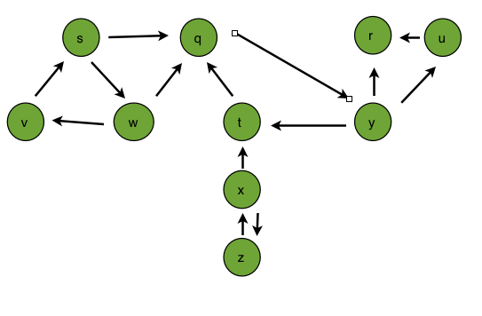

### Exercises 22.5-1
How can the number of strongly connected components of a graph change if a new edge is added?

### `Answer`
* 如果增加的是一个强连通分量里面的边,那么不会影响.
* 如果增加的是不同连通分量之间的边,那么可能不会减少,也可能会减少,最多减少到1.

### Exercises 22.5-2
***
Show how the procedure STRONGLY-CONNECTED-COMPONENTS works on the graph of Figure 22.6. Specifically, show the finishing times computed in line 1 and the forest produced in line 3. Assume that the loop of lines 5-7 of DFS considers vertices in alphabetical order and that the adjacency lists are in alphabetical order.

### `Answer`
first, we need the finishing times:

~ | q | r | s |	t | u | v |	w |	x |	y |	z
:---:|:---:|:---:|:---:|:---:|:---:|:---:|:---:|:---:|:---:|:---:
d | 1 | 17 | 2 | 8  | 18 |	3 |	4 |9  |	13 | 10
f | 16|	20 | 7 | 15 | 19 |	6 |	5 |12 |	14 | 11

Then, we need to compute the transpose:

Finally, we need the finishing times of the transpose with respect to the original finishing times:

~ | q | r | s |	t | u | v |	w |	x |	y |	z
:---:|:---:|:---:|:---:|:---:|:---:|:---:|:---:|:---:|:---:|:---:
d | 5 | 1 | 15 | 7  | 3 |	17 | 16 | 11 |	6 | 12
f | 10|	2 | 20 | 8 | 4 | 18 | 19 |14 |	9 | 13

Giving us the following components:
{r} -> {u} -> {q, y, t} -> {x, z} -> {s, w, v} 

[reference](http://student.csuci.edu/~douglas.holmes253/Assignment6.html)

### Exercises 22.5-3
***
Professor Deaver claims that the algorithm for strongly connected components can be simplified by using the original (instead of the transpose) graph in the second depth-first search and scanning the vertices in order of increasing finishing times. Is the professor correct?

### `Answer`
Consider vertex1 to vertex0 vertex0 to vertex2 and vertex0 to vertex1
For this algorithm, the first DFS will give a list 1 2 0 for the second DFS. All vertices will be incorrectly reported to be in the same SCC.
For the CLRS algorithm, the first DFS will give a list 0 2 1 for the second DFS. After reversing edges, the correct SCCs {0, 1} and {2} will be reported.

### Exercises 22.5-4
***
Prove that for any directed graph G, we have ((GT)SCC)T = GSCC. That is, the transpose of the
component graph of GT is the same as the component graph of G.

### `Answer`
Since the strongly connected relationship is an equivalence relation, G and GT will always have the same strongly connected components.  If two vertices X and Y are not strongly connected, then there is a unique path from X to Y in G iff there is a unique path from Y to X in GT.

A similar property will also hold for the component graph and transpose of the component graph, i.e. If two vertices X and Y are not strongly connected in G, then here is a unique path from SCC(G,X) to SCC(G,Y) in (G)SCC iff there is a unique path from SCC(GT,Y) to SCC(GT,X) in (GT)SCC).
			
### Exercises 22.5-5
***
Give an O(V + E)-time algorithm to compute the component graph of a directed graph G = (V, E). Make sure that there is at most one edge between two vertices in the component graph your algorithm produces.

### `Answer`
先执行STRONGLY-CONNECTED-COMPONENTS过程,然后对每个节点赋予[1,k]中的一个值,即生成的k个强联通分量.第k个强联通分量里面的所有节点的值为k. 然后遍历每一个节点i,对Adj[i]的每一个节点j, 如果k[i]和k[j]以前没有边,则加上. 

### Exercises 22.5-6
***
Given a directed graph G = (V, E), explain how to create another graph G′ = (V, E′) such that (a) G′ has the same strongly connected components as G, (b) G′ has the same component graph as G, and (c) E′ is as small as possible. Describe a fast algorithm to compute G′.

### `Answer`
1. 先对原图G生成k个联通分量和一个SCC子图.

2. 遍历k个所有的联通分量. 对每个联通分量,必然有一个能够到所有点的回路,只添加该回路到新的图.假设第i个联通分量有5个节点a,b,c,d,e,我们只需要添加边a->b,b->c,c->d,d->e,e->a即可.

3. 选SCC子图的边,加到新的图. 节点可以任意选择.

### Exercises 22.5-7
***
A directed graph G = (V, E) is semiconnected  if, for all pairs of vertices u, v ∈ V, 
we have u ~> v or v ~> u. Give an efficient algorithm to determine whether
or not G is semiconnected. Prove that your algorithm is correct, and analyze its
running time.

### `Answer`

强连通组件算法, 按第 2 次 DFS(GT) 强连通组件生成顺序编号, 假设是 SCC1, SCC2, ..., SCCn
如果存在边 (SCC1, SCC2), (SCC2, SCC3), ..., (SCCn-1, SCCn) , 即组件间边形成线性的链, 
则图 G 是 semiconnected. 稍后详细解释.

1. 强连通组件图算法, 时间 O(V+E)
2. 按强连通组件 SCC 顺序编号, 假设是SCC1, SCC2, ..., SCCn, 并求出组件 SCC 的邻接表, 
这步骤可以在 (1) 中完成, 所以时间 O(V+E)
3. 遍历 SCC 邻接表, 如果对于范围 i = 1, 2, ..., n-1, 强连通组件SCCi.adj 中存在 SCCi+1 , 
既含有边 (SCCi, SCCi+1), 强连通组件图是线性链, 则 G = (V, E) 是 semiconnected, 时间 O(V+E).
详细解释, 按算法理论的支持, SCCi+1 不存在到SCCi 的边, 如果没有 (SCCi, SCCi+1), 
则两者均无法到达对方, 即不符合 G 是 semiconnected 的概念. 算法时间复杂度 O(V+E)

[reference](http://blog.csdn.net/anye3000/article/details/9791213)

***
Follow [@louis1992](https://github.com/gzc) on github to help finish this task.

